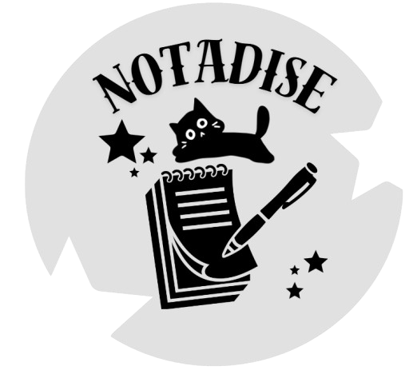

<h1 align = "center"> NOTADISE </h1>

<p align = "center">
    
</p>

## ˚ʚ♡ɞ˚ About
<p align = "center">
Notadise is an WebApp that can be used for taking notes. You can create, share and edit notes anytime! It has really simple and cozy interface that makes taking notes a piece of cake!! <br>
</p>

<hr> 

## 🔧 Tools used for this project:

<br>

### ⤷ IDE and collaborative/hosting service and language tools used for the WebApp
<p align = "left">
    <a href="https://visualstudio.microsoft.com/vs/"></a>
    <a href="https://github.com/"></a>
    <a href="https://learn.microsoft.com/en-us/dotnet/csharp/"></a>
    <a href="https://developer.mozilla.org/en-US/docs/Web/HTML"></a>
    <a href="https://developer.mozilla.org/en-US/docs/Web/CSS"></a>
    <a href="https://developer.mozilla.org/en-US/docs/Web/JavaScript"></a>
</p>

<hr>

### ⤷ Design and creating assets🎨🖌
<p align = "left">
    <a href="https://www.figma.com/"></a>
    <a href="https://krita.org/en/"></a>
</p>

<hr> 

### ⤷ Documentation and schemes 📃
<p align = "left">
    <a href="https://www.microsoft.com/en-us/microsoft-365/powerpoint"></a>
    <a href="https://www.microsoft.com/en-us/microsoft-365/word"></a>
    <a href="https://www.lucidchart.com/"></a>
</p>

<br>
<hr> 


## </> Installation

🌐 ｡ ₊°⊹ ࣪ ˖💿๋࣭ ⭑
You can download Notadise now by using the "Code" button on the main page.

Or by copy/pasting this code in your CMD:
```
git clone https://github.com/GIBineva/Notadise.git

